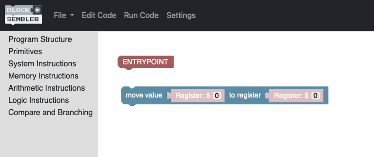
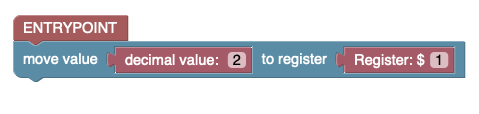
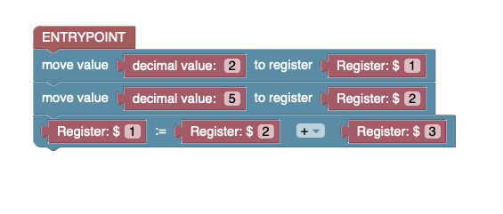
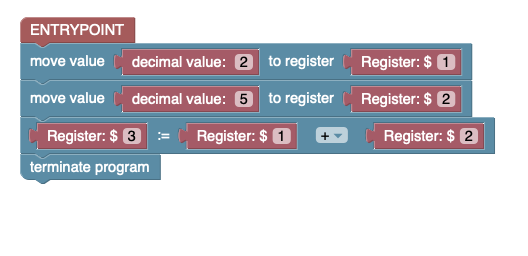
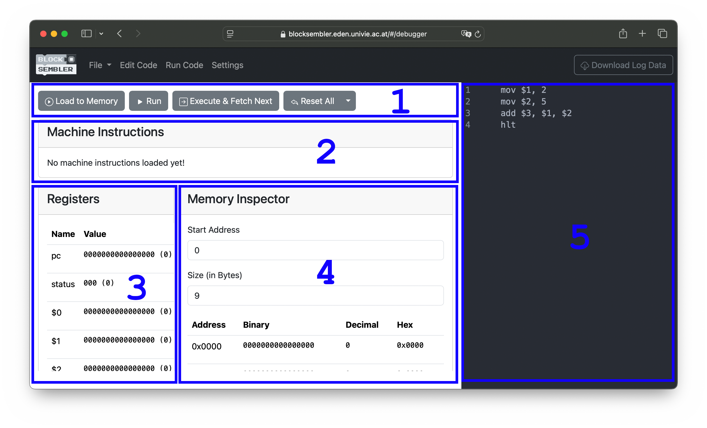
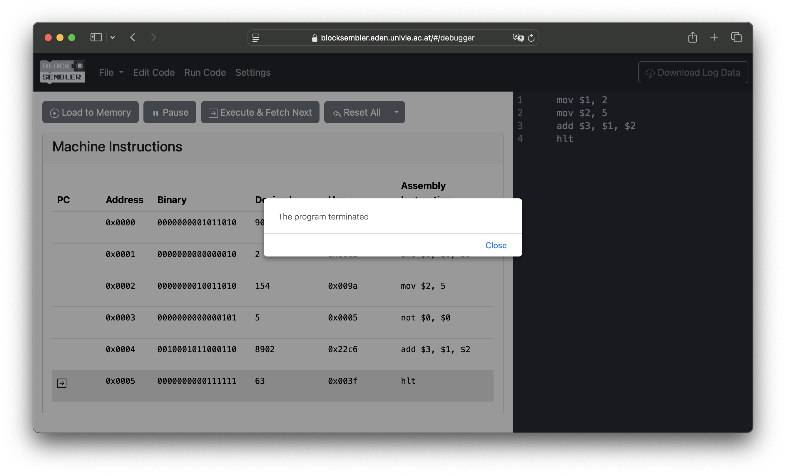
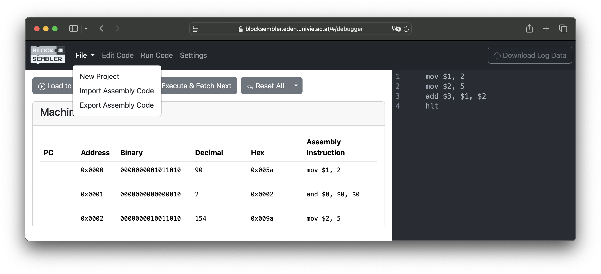
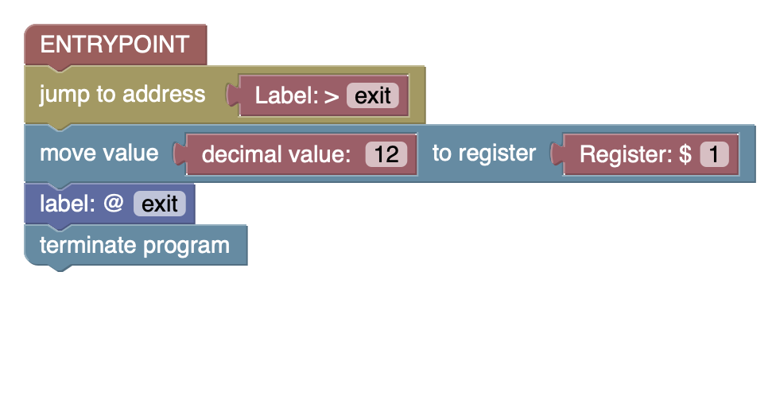
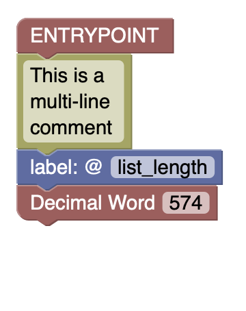

Blocksembler
============

.. _what_is_blocksembler:

What is Blocksembler?
---------------------

`Blocksembler <https://blocksembler.github.io>`_ is a block-based programming environment that allows to compose and excute *armlet* assembly code. The main difference to conventionel text-based code editors is that Blocksembler allows users to compose instructions via drag and drop similar to other block-based programming environments like `Scratch <https://scratch.mit.edu>`_ and `MakeCode <https://makecode.microbit.org>`_. As depicted in the following picture, instructions are represented as visual blocks, hence the name: 

.. image:: _images/move-instruction.png
   :align: center

Most assembly instructions expect arguments that can be either specific registers, immediate values (e.g. decimal or hexadecimal values) or labels. These primitives are shaped similar to puzzle pieces and can be snapted into the instructions.

.. note::
   Blocksembler automatically prevents invalid block connections. For example, in a move instruction, only register primitives are valid as the second argument. Attempting to snap a decimal value primitive into that slot will not work.

Walkthrough  
-----------

In this guide, we will implement a simple *armlet* program that stores two values in registers ``$1`` and ``$2``, adds them, and stores the result in register ``$3``. Finally, we will execute the program using the integrated *armlet* emulator.

Step 1: Opening *Blocksembler*
^^^^^^^^^^^^^^^^^^^^^^^^^^^^^^

Open the browser and visit `<https://blocksembler.github.io>`_ and click on |button| which leads you to follwing page:

.. image:: _images/blocksembler-overview.png
   :align: center

The Blocksembler code editor consists of three parts:

1. **The Toolbox**.
   
   All *armlet* assembly instructions are grouped in categories (e.g. System Instructions). You can browse through the instructions by clicking on the categories.  

2. **The Workspace**

   The *Workspace* is the place were the assembly program is composed. You can drag instructions from the toolbox into this area or rearange your assembly program via drag and drop.

3. **The Assembly Code View**

   While crafting block-based assembly programms in the workspace, the *Assembly Code View* displays the according text-based assembly code. 

Step 2: Starting a New Project
^^^^^^^^^^^^^^^^^^^^^^^^^^^^^^

To start a new project click on ``File -> New Project`` in the top menu. This will remove any blocks from the *Workspace* and immediatly add a *Entrypoint*-block to your workspace.

.. image:: _images/new-project.png
   :align: center

The *Entrypoint* block acts as the starting point of your program in Blocksembler. When the generated code is executed, the instructions connected to this block will be run first.

.. note::
   Since every *armlet* program has a single distinct starting point (i.e., the instruction stored at address ``0x0000``), Blocksembler ensures that you cannot add a second *Entrypoint* block.

Step 3: Dragging Instructions into the Workspace
^^^^^^^^^^^^^^^^^^^^^^^^^^^^^^^^^^^^^^^^^^^^^^^^

As a first step we are going to look for the ``move``-instruction in the ``Memory Operations``-toolbox and drag it into the workspace. The first thing one might notice is, that the instruction we just dragged into the workspace looks a bit different than the move instruction shown before. Instead of the red primitive blocks we see transparent blocks filling the two slots:

By default, newly added instructions include placeholder (“shadow”) blocks for their arguments. These placeholders are fully functional, but they’ll disappear the moment you replace them with a real primitive block. As we want to move a decimal value into a register we are going to fill the two slots with an decimal and register block as shown below:

.. warning::
   Only blocks connected to the *Entrypoint* block or its successors are considered by the code generator. You can test this by disconnecting the `move` instruction from the **Entrypoint** block and observing the changes in the *Assembly Code View*.

Finally, we add another ``mov``-instruction and a ``add``-instruction (can be found in the *Arithmetic Instructions* toolbox) that we end up with a program like this:

Step 4: Terminating the Program with *halt*-Instructions
^^^^^^^^^^^^^^^^^^^^^^^^^^^^^^^^^^^^^^^^^^^^^^^^^^^^^^^^

In *armlet* assembly, programs terminate when they encounter a corresponding **halt** instruction. You can find these instructions in the **System Structure** toolbox, labeled **“terminate the program.”** Drag a **halt** instruction into the workspace, then attach it below the previously added **move** instruction:

Step 5: Switching to the Emulator
^^^^^^^^^^^^^^^^^^^^^^^^^^^^^^^^^

To run a the program we've just created, we need to switch to the debug mode by clicking on *Run Code* item in the application menu (clicking on *Edit Code* leads back to the block-based editor):

1. **The Control Panel**

   The Control Panel provides all the functionality needed to interact with the emulator. You can load programs into memory, run them, or reset the emulator to its initial state.

2. **Loaded Program**

   This section displays not only the loaded machine code but also its potential interpretations. Since a single binary word—such as `0000000001011010`—can be viewed in multiple ways, you can see both its decimal equivalent (e.g., `90`) and the corresponding *armlet* instruction (e.g., `mov $1, 2`).

3. **Register View**

   Here, you can see the current values of all registers, including the program counter (`pc`) and status flags.

4. **Memory Spy**

   Because the emulator's memory is much larger than the portion shown in the *Loaded Program* section, the Memory Spy allows you to inspect any memory area by specifying:  
   
      - A **Start Address** (in decimal or hexadecimal), and  
      - A **Size** (maximum of 30 words).  

   It will then display the specified number of words starting from the provided address.

5. **Assembly Code View**

   Displays the assembly source code.

Step 6: Running the Program
^^^^^^^^^^^^^^^^^^^^^^^^^^^

To run the program we've created in **Step 1** - **Step 4** we need to follow these steps:

1. Load the program to memory by clicking on the |load-button| button in the *Control Panel*

2. Run the Programm by clicking on the |run-button| button. This will start the automatic execution of the programm. While execution the instruction that is going to be executed next is highlighted in the *Loaded Program* section.

   **Optional:** By clicking the |step-button| button, only the next instruction is executed. This allows users to step through the program one instruction at a time.

.. |load-button| image:: _images/load-button.png
   :align: middle
   :height: 40

.. |run-button| image:: _images/run-button.png
   :align: middle
   :height: 40

Once the program terminates, the user receives a notification via an alert message.

Step 7: Importing/Exporting your Solutions
^^^^^^^^^^^^^^^^^^^^^^^^^^^^^^^^^^^^^^^^^^

Finally, you can import or export assembly code by clicking on ``File -> Export Assembly Code`` or ``File -> Import Assembly Code``.

Labels & Jump instructions
--------------------------

Whenever we want to redirect execution to a different location in the program, we use labels to specify the exact jump destination. Labels are defined using a label definition block (|label-def|), which refers to the block immediately following it.

To refer to a label (e.g. specifying the target of a ``jmp`` instruction) we use label primitives (|label-prim|).

.. note::
   During the transformation of the assembly program into machine code, these labels are replaced with the actual addresses they refer to.

The following example gives a short demonstration on how labels are used in Blocksembler. The program effectively omits the ``mov`` instruction and jumps directly to the ``hlt`` instruction.

.. warning::
   Whenever a label primitive (|label-prim|) is used in an *armlet* instruction, the corresponding label must be defined (|label-def|) somewhere in the code. Otherwise, Blocksembler will not know which program location the label refers to.

.. warning::
   To avoid ambiguity, each label (e.g., |label-def|) can be defined only once within the code.

.. |label-prim| image:: _images/label-prim.png
   :align: middle
   :height: 35

Directives
----------

The *armlet* assembly language also provides directives (e.g., ``%data``) that can be used to define data that should be loaded into memory when the program starts. For example, the following program loads the values ``574`` and ``937`` into memory addresses ``0x0000`` and ``0x0001``.

.. image:: _images/directive-example.png
   :align: center
   :width: 200px

.. hint::
   It is also possible to use labels to refer to these data words:

   .. image:: _images/label-directive-example.png
      :align: center
      :width: 200px

Comments
--------

In Blocksembler there are two ways to comment your code:

Use in-line comments 
^^^^^^^^^^^^^^^^^^^^

To create an inline comment, right-click on the relevant block and select **"Add Comment"**. The added comment can be toggled open or closed by clicking on the blue question mark.

.. image:: _images/in-line-comment.png
      :align: center
      :width: 400px

Use the multi-line comment block
^^^^^^^^^^^^^^^^^^^^^^^^^^^^^^^^
If a larger comment is needed, multi-line comments can be placed between comment blocks, as shown in the following example:

